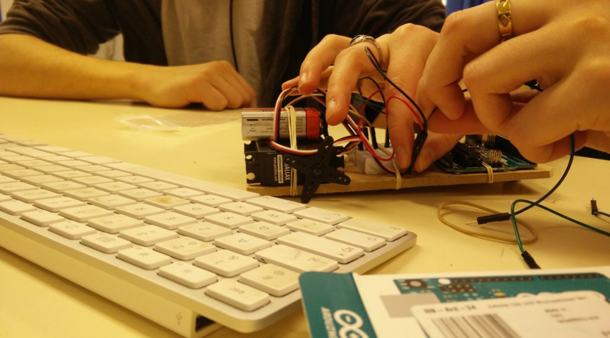
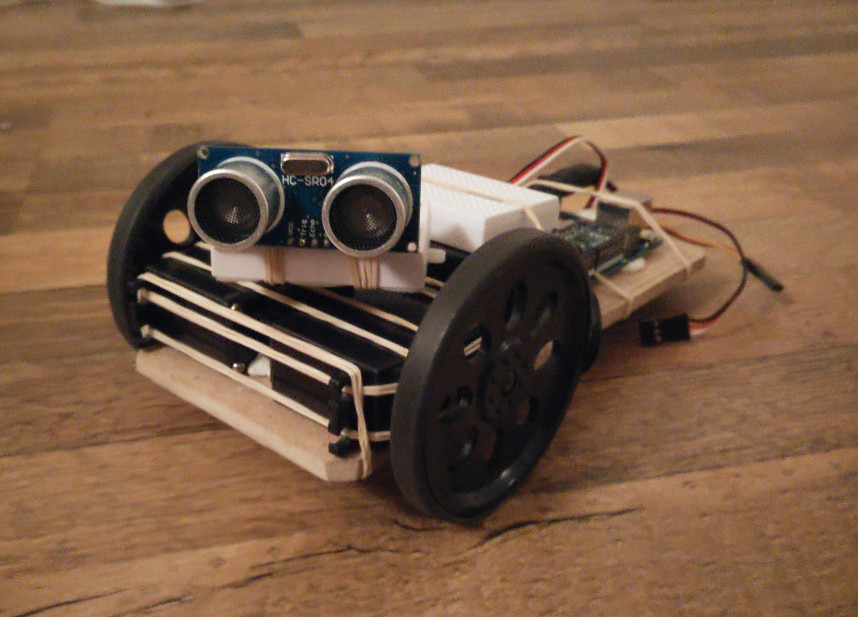

wall-Eeno
=========

Minimalist Arduino-based robot for fun and pedagogical purposes

In development / see also the page dedicated to the [Arduino workshop](https://github.com/hackstub/atelierArduino)

Illustrations
-------------

Todo / ideas
------------

- Exploration of a room/labyrinth with ultrasonic sensor, maping what it finds
- Take inspiration from the MARI/O project and train a neural network to command the robot (in an emulator first)
- Sending info through wifi connection (ESP8266 ?)
- R2D2-like sounds ?
- Animated mouth using small pixel matrix
- Communication and cooperation with other robots ?
